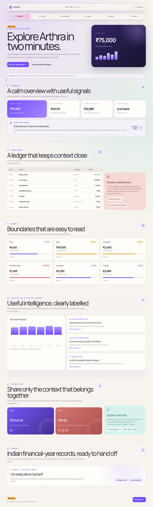
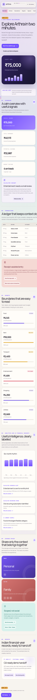

# Arthra

### Personal finance, built for India.

Arthra is a full-stack personal-finance workspace designed around everyday Indian financial workflows. It helps people track income and expenses, manage category budgets, understand spending patterns, organize shared expenses through Expense Spaces, generate financial-year reports, and share read-only reports with controlled access.

[Live Demo](https://arthrafin-7qakibfj.manus.space) · [Try Demo](https://arthrafin-7qakibfj.manus.space/demo) · [GitHub Repository](https://github.com/Abhirai2006/arthra) · [User Guide](./USER_GUIDE.md)

## Screenshots

| Landing page | Interactive demo walkthrough |
| --- | --- |
|  |  |

| Mobile landing | Mobile demo flow |
| --- | --- |
|  |  |

## Why Arthra?

Arthra focuses on practical personal and household financial record-keeping rather than trying to become a banking or investment platform. Its core design decisions support Indian financial-year conventions, INR-aware currency handling, GST-aware transaction records, scoped shared financial spaces, reviewable reports, and privacy-conscious handling of finance data.

## Key Features

### Personal Finance

- Income and expense tracking with categories, accounts, notes, search, and filtering.
- Receipt attachments with protected retrieval paths.
- INR formatting with integer-paise storage for monetary values.

### Budgets & Analytics

- Monthly category budgets with animated utilization indicators.
- Spending trends, category distribution, unusual-spend cues, recurring-spend detection, and budget-risk signals.
- Optional, explicit AI-assisted summaries that remain distinct from deterministic calculations.

### Expense Spaces

- Separate financial contexts for personal, household, trip, or group spending.
- Owner, Editor, and Viewer roles with server-enforced scoped access.
- Invitations plus shared categories and accounts for permitted members.

### Reports

- April–March financial-year reporting with GST references.
- CA-oriented CSV export and time-limited, revocable read-only report links.

### Product Experience

- Responsive mobile interface, dark and light themes, PWA assets, accessible controls, reduced-motion support, and a read-only demo mode.

## Smart Financial Insights

Arthra combines deterministic financial calculations with optional AI-assisted summaries to help users interpret their existing transaction data.

| Deterministic insights | Optional AI-assisted summaries |
| --- | --- |
| Spending trends, recurring expenses, budget-risk signals, and unusual-spending patterns. | Concise natural-language summaries of available authorized aggregates through the server-side application flow. |

AI-assisted summaries do not automatically create or modify transactions, and receipt suggestions remain user-reviewable drafts.

> Arthra is a financial record-keeping and analysis workspace. Its insights are informational and are not financial, investment, tax, legal, or accounting advice.

## Built for Indian Financial Workflows

Arthra is designed around conventions commonly used in Indian personal and household financial record-keeping. Monetary values are represented as integer paise and financial-year reporting follows the April–March cycle.

The product uses INR and `en-IN` formatting, supports lakh/crore-friendly presentation, keeps GST-related transaction information close to the record, and includes CGST/SGST or IGST context where relevant. It does not claim government, banking, tax, or GST endorsement.

## Security & Privacy

Authentication protects private workspace access, and finance procedures enforce authorization server-side. Expense Space permissions are role-based; protected routes do not serialize financial records into public SSR HTML; receipt files use protected retrieval paths; and CA report links can be time-limited and revoked. Financial values are stored as integer paise.

Arthra is designed with financial-data privacy in mind, but it should not be presented as a regulated banking or financial institution.

## Tech Stack

| Layer | Technology |
| --- | --- |
| Frontend | React 19, TypeScript |
| Styling | Tailwind CSS and project CSS tokens |
| UI | Radix UI / shadcn components |
| Routing | Wouter |
| Data fetching | TanStack Query |
| Charts | Recharts |
| Animation | Framer Motion |
| Backend | Express |
| API | tRPC |
| Serialization | SuperJSON |
| Database | MySQL / TiDB |
| ORM | Drizzle ORM |
| Authentication | Manus OAuth |
| Storage | Secure object storage |
| Email | Resend |
| Testing | Vitest |
| PWA | Service Worker and Web App Manifest |

## Architecture

```text
Browser / PWA
      ↓
React + TypeScript
      ↓
Express + tRPC
      ↓
Drizzle ORM
      ↓
MySQL / TiDB
```

Public routes are separated from protected workspace routes. Server-side procedures enforce authorization, while financial data loads only in authenticated and scoped contexts. Receipt bytes are stored separately from relational finance data. Optional AI-assisted processing occurs server-side after an explicit user action.

## Try the Demo

Arthra includes a [read-only demo environment](https://arthrafin-7qakibfj.manus.space/demo) for recruiters, interviewers, and product evaluation. It requires no sign-in, keeps a visible `DEMO DATA` label, uses fictional data only, never modifies a real user account, and demonstrates the dashboard, transactions, budgets, analytics, Expense Spaces, and reports in one guided flow.

## Testing

The automated suite currently has **27 passing tests** across financial calculations, Indian financial-year boundaries, authorization, transactions, receipts, budgets, analytics, Expense Spaces, CA reports, share-link revocation, SSR privacy behavior, onboarding, and demo isolation.

```bash
pnpm check
pnpm test
pnpm build
```

## Run Locally

Use Node.js 22 and pnpm. The managed project environment supplies database, OAuth, storage, and optional email settings; do not commit `.env` files or credentials.

```bash
gh repo clone Abhirai2006/arthra
cd arthra
pnpm install --frozen-lockfile
pnpm dev
```

For the complete first-run workflow, operational notes, scheduler details, and troubleshooting guidance, read the [User Guide](./USER_GUIDE.md) and [verification notes](./verification_notes.md).

## License

Arthra is available under the [MIT License](./LICENSE).
