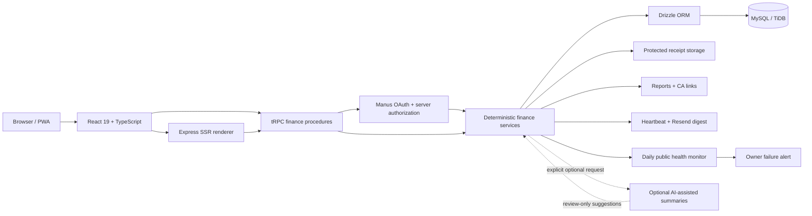

<div align="center">

# Arthra

**Personal finance, built for India.**

A full-stack personal-finance workspace designed around everyday Indian financial workflows - income and expense tracking, category budgets, shared Expense Spaces, financial-year reports, and controlled read-only sharing.

[](./LICENSE)
[](https://github.com/Abhirai2006/arthra/stargazers)
[](https://github.com/Abhirai2006/arthra/network/members)
[](https://github.com/Abhirai2006/arthra/commits)
[](#testing)

[](https://react.dev)
[](https://www.typescriptlang.org)
[](https://tailwindcss.com)
[](https://trpc.io)
[](https://orm.drizzle.team)
[](#tech-stack)
[](#testing)

<p>
  <a href="https://arthrafin-7qakibfj.manus.space"></a>
  <a href="https://arthrafin-7qakibfj.manus.space/demo"></a>
  <a href="https://portfolio-abhirai2006.lovable.app"></a>
  <a href="https://github.com/Abhirai2006/arthra"></a>
  <a href="./USER_GUIDE.md"></a>
</p>

<p align="center">
  <a href="https://arthrafin-7qakibfj.manus.space">
    
  </a>
</p>

</div>

---

## Table of Contents

- [Screenshots](#screenshots)
- [Why Arthra?](#why-arthra)
- [Key Features](#key-features)
  - [Personal Finance](#personal-finance)
  - [Budgets & Analytics](#budgets--analytics)
  - [Expense Spaces](#expense-spaces)
  - [Reports](#reports)
  - [Product Experience](#product-experience)
- [Public Feedback & Website Reliability](#public-feedback--website-reliability)
- [Public Site, Discovery & Consent](#public-site-discovery--consent)
- [Smart Financial Insights](#smart-financial-insights)
- [Built for Indian Financial Workflows](#built-for-indian-financial-workflows)
- [Security & Privacy](#security--privacy)
- [Security Hardening Record](#security-hardening-record)
- [Launch Readiness](#launch-readiness)
- [Reddit Launch Playbook](#reddit-launch-playbook)
- [Tech Stack](#tech-stack)
- [Architecture](#architecture)
- [Try the Demo](#try-the-demo)
- [Testing](#testing)
- [Run Locally](#run-locally)
- [Contributing](#contributing)
- [License](#license)

---

## Screenshots

The current captures show the latest public **light** interface: paper-white surfaces, ink typography, intentional green/blue signals, the current responsive navigation, and the consent-gated feedback flow. Dark mode remains available from the public theme control.

| Desktop landing | Desktop feedback |
| --- | --- |
|  |  |

| Mobile landing | Mobile feedback |
| --- | --- |
|  |  |

<p align="right"><a href="#arthra">↑ back to top</a></p>

## Why Arthra?

Arthra focuses on practical personal and household financial record-keeping rather than trying to become a banking or investment platform. Its core design decisions support:

- Indian financial-year conventions (April–March)
- INR-aware currency handling with integer-paise storage
- GST-aware transaction records
- Scoped shared financial spaces (Expense Spaces)
- Reviewable, revocable report sharing
- Privacy-conscious handling of finance data

## Key Features

### Personal Finance

- Income and expense tracking with categories, accounts, notes, search, and filtering
- Review-first transaction-history import for `.csv`, `.xlsx`, and `.xls` files, with column mapping, duplicate checks, and explicit confirmation
- Receipt attachments with protected retrieval paths
- INR formatting with integer-paise storage for monetary values

### Budgets & Analytics

- Monthly category budgets with animated utilization indicators
- Spending trends, category distribution, unusual-spend cues, recurring-spend detection, and budget-risk signals
- Optional, explicit AI-assisted summaries that remain distinct from deterministic calculations

### Expense Spaces

- Separate financial contexts for personal, household, trip, or group spending
- Owner, Editor, and Viewer roles with server-enforced scoped access
- Invitations plus shared categories and accounts for permitted members

### Reports

- April–March financial-year reporting with GST references
- CA-oriented CSV export and time-limited, revocable read-only report links

### Product Experience

- A persisted light/dark control in the shared dashboard shell: desktop sidebar and mobile header access it on Overview, Transactions, Budgets, Expense Spaces, Analytics, and Reports. Each authenticated route inherits the same semantic graphite/paper, green, and blue materials.
- Responsive mobile interface, PWA assets, accessible controls, reduced-motion support, and a read-only demo mode
- Deliberate public footer navigation, grouped into **Explore Arthra**, **Product principles**, and **Creator & code**, with a compact back-to-top utility and responsive touch-friendly layout
- A pre-sign-in trust panel that plainly explains that Arthra is hosted, links directly to Privacy and Contact pathways, and avoids unsupported device-only or absolute-security claims
- A visible optional image/PDF receipt step in transaction create and edit flows, alongside existing protected receipt retrieval and review-first receipt suggestions
- Layered product-preview depth, gentle pointer-device hover tilt, and a 3D-style trust orb that are all suppressed for people who prefer reduced motion

### Public Feedback & Website Reliability

Arthra accepts product feedback through a public form that gives a clear inline explanation when a required rating, feedback message, or optional email format needs attention. The form surfaces readable server failures instead of raw validation payloads, and its anti-spam guard rejects non-human submissions before any feedback row is stored.

Public feedback is never fabricated. A valid feedback form submission is published automatically after validation and anti-spam checks; the form explains this before submission, email addresses never appear publicly, and the configured owner can permanently delete a published item. Public feedback data intentionally excludes contact details. Public links distinguish [Abhishek Rai’s portfolio](https://portfolio-abhirai2006.lovable.app), which presents projects and case studies, from [the Arthra repository](https://github.com/Abhirai2006/arthra), which contains the open-source application code and version history.

When this workflow replaced manual approval on 26 August 2026, the one existing pending record that already had public-display permission was moved to `approved`; records without that prior permission were not changed. The live `/feedback` page was then checked and displayed the approved record successfully.

For protected finance pages, workspace bootstrap failures and missing active-space states resolve to retryable error screens rather than an indefinite dashboard skeleton. The selected Expense Space stays stable through normal data refreshes, and routine focus changes do not trigger unnecessary workspace bootstrap refetches.

### Public Site, Discovery & Consent

The public site includes internal navigation, a custom 404 response, semantic breadcrumbs on support routes, About, Contact, Waitlist, and Thank You pages, a five-question FAQ section, a favicon, and purposeful CTA content above public form fields. Contact and waitlist submissions are private, consent-based, rate-limited, honeypot-protected, and have no public listing endpoint.

Public analytics are **optional**. The analytics script is not present in the static HTML; visitors can choose “Essential only” or “Allow analytics” from the cookie-preference panel, while private finance data is never sent to website analytics. SSR supplies unique titles, descriptions, canonical URLs, Open Graph image/alt metadata, and appropriate `noindex` directives for conversion and tokenized routes. The sitemap and crawler policy list only intended public discovery routes.

For agents and LLM-oriented discovery, the public [`/llms.txt`](https://arthrafin-7qakibfj.manus.space/llms.txt) file provides a concise, curated map of the public product, policy, contact, and source-documentation pages. It repeats the controlled-beta and privacy boundaries rather than making unsupported launch, security, or financial-advice claims.

Finance data access is row/scoped at the authenticated application-procedure layer rather than claimed as unsupported database-native RLS. The exact boundary model, endpoint review requirements, and operational distinction are documented in [`docs/DATA_ACCESS_BOUNDARIES.md`](./docs/DATA_ACCESS_BOUNDARIES.md).

<p align="right"><a href="#arthra">↑ back to top</a></p>

## Smart Financial Insights

Arthra combines deterministic financial calculations with optional AI-assisted summaries to help users interpret their existing transaction data.

| Deterministic insights | Optional AI-assisted summaries |
| --- | --- |
| Spending trends, recurring expenses, budget-risk signals, and unusual-spending patterns. | Concise natural-language summaries of available authorized aggregates through the server-side application flow. |

AI-assisted summaries do not automatically create or modify transactions, and receipt suggestions remain user-reviewable drafts.

> **Note:** Arthra is a financial record-keeping and analysis workspace. Its insights are informational and are not financial, investment, tax, legal, or accounting advice.

## Built for Indian Financial Workflows

Arthra is designed around conventions commonly used in Indian personal and household financial record-keeping. Monetary values are represented as integer paise, and financial-year reporting follows the April–March cycle.

The product uses INR and `en-IN` formatting, supports lakh/crore-friendly presentation, keeps GST-related transaction information close to the record, and includes CGST/SGST or IGST context where relevant. It does not claim government, banking, tax, or GST endorsement.

## Security & Privacy

<details>
<summary><strong>Expand for details</strong></summary>
<br>

| Protection area | Implemented safeguard |
| --- | --- |
| Authentication | OAuth state/nonce validation and HTTP-only session cookies protect sign-in and private workspace access. |
| Authorization | Protected tRPC procedures, server-side ownership checks, and Expense Space roles enforce data scopes. |
| Browser boundary | A nonce-based Content Security Policy, anti-framing policy, referrer policy, browser-permission restrictions, and anti-sniffing headers are sent on every response. |
| API resilience | API responses are marked `no-store`; bounded request parsing and a per-client request budget reduce oversized-payload and request-flood exposure. |
| Files and sharing | Receipt MIME/size checks, public-storage key validation, HTTPS-only signed redirects, protected retrieval, and time-limited revocable CA links constrain file and reporting paths. |
| Public feedback | The form clearly discloses automatic public posting; honeypot, validation, and rate limits protect submissions, emails remain private, and the owner can permanently delete published feedback. |
| Supply chain | Axios and AWS storage SDK packages were updated; the latest audited production dependency scan has **0 critical** advisories. |

</details>

## Security Hardening Record

Arthra is designed with financial-data privacy in mind, but no public application can honestly promise that it is impossible to attack. The hardening record explains verified safeguards, dependency-audit results, testing evidence, and remaining operational responsibilities: [`docs/SECURITY_HARDENING.md`](./docs/SECURITY_HARDENING.md).

The current dependency audit reports **0 critical**, **7 high**, **30 moderate**, and **7 low** production advisories after direct Axios, AWS SDK, and NanoID updates. The remaining high-risk items require an ongoing maintenance decision rather than a misleading claim of absolute safety; notably, the `xlsx` package used for user-selected spreadsheet imports has a published no-fix npm advisory. Treat externally supplied spreadsheets as untrusted and plan a supported parser migration before broadening that importer’s exposure.

## Launch Readiness

**Current status: controlled beta, not a broad public launch.** Arthra has a deployed SSR public site, protected finance procedures, a security-header baseline, opt-in analytics, consent-based public forms, sitemap/robots/canonical metadata, and automated validation. The public technical foundation is ready for a small invited group, but it is not honest to promise that any stranger can sign in without friction or that the site is already indexed by Google.

Before a broad launch, complete and retain evidence for an independent first-time production sign-in and onboarding; Google Search Console property verification, sitemap submission, and live URL inspection; confirmed production custom-404 behavior; a legal review of the published privacy/terms package and account-deletion process; monitoring, alerting, and backup/restore drills; and ownership/remediation of remaining high-severity dependencies. Google states that a sitemap is a discovery hint, not an indexing guarantee.[1]

The configured owner now has a private **Owner Operations** workspace route for Contact and Waitlist records: consented records can be reviewed, classified, and deleted, while new submissions attempt a content-free owner alert. A cron-authenticated daily public health monitor is active at **09:00 UTC** for the home-page sign-in entry, sitemap, and missing-route contract; it records a private status and alerts the owner only on a new or changed failure. The monitor does not include finance, session, Contact, or Waitlist data in alerts. Its first scheduled execution and alert-delivery evidence remain operational follow-ups. This improvement does not replace an owner-defined support channel, notification verification, retention schedule, legal review, or a tested backup/restore process. See [`docs/LAUNCH_OPERATIONS_RUNBOOK.md`](./docs/LAUNCH_OPERATIONS_RUNBOOK.md) for the required operating evidence.

As of 24 August 2026, the Arthra URL-prefix property is verified in Google Search Console through the deployed HTML tag, `/sitemap.xml` is submitted successfully with four discovered pages, and the root’s live test reports that it is available to Google and can be indexed. Google Index still shows the root as “Discovered — currently not indexed,” and the owner account’s manual-indexing request quota was exceeded for the day, so this is **not** a claim of current search-result visibility. The remaining unknown-route hosting fallback blocker and the exact evidence are maintained in [`docs/LAUNCH_READINESS_ASSESSMENT.md`](./docs/LAUNCH_READINESS_ASSESSMENT.md).

The production sign-in return check is also **not complete**: the owner session logged out safely, but the configured Manus OAuth destination presented a temporary maintenance page on 24 August 2026 instead of authentication. Treat this external identity-service availability issue as a beta-launch blocker until a successful independent sign-in, onboarding, logout, and return-login sequence is recorded.

The public Privacy and Terms pages now identify **Abhishek Rai A, individual operator**, have an effective date of **25 August 2026**, state the user-confirmed Contact/Waitlist retention periods, and limit public use to people aged 18+. The public privacy/support contact method is the private [`/contact`](https://arthrafin-7qakibfj.manus.space/contact) route, which is recorded in Owner Operations. This is a factual operating baseline, not a substitute for jurisdiction-specific legal review or a verified staffed-support response practice.

The full evidence, blocker list, and beta gate are in [`docs/LAUNCH_READINESS_ASSESSMENT.md`](./docs/LAUNCH_READINESS_ASSESSMENT.md). The transparent asset-sale versus traction-based commercial framework and the project entity card are in [`docs/ARTHRA_ENTITY_CARD.md`](./docs/ARTHRA_ENTITY_CARD.md). Any sale should be framed as a source/product asset until it has verified users, revenue, retention, and transferable operating evidence.

<p align="right"><a href="#arthra">↑ back to top</a></p>

## Reddit Launch Playbook

Arthra’s Reddit approach is deliberately **feedback-first rather than promotional**: it uses one natural founder-voice post in a project-friendly community, one genuine public product screenshot, and one primary product link. It prohibits cross-posting, vote requests, private-message outreach, generated mock imagery, and financial-advice claims, and treats any community feedback as product input rather than a testimonial. The prepared post, community-rule research, reply protocol, confirmation gate, and user-facing paste-ready package are documented in [`docs/REDDIT_LAUNCH_PLAYBOOK.md`](./docs/REDDIT_LAUNCH_PLAYBOOK.md) and [`docs/REDDIT_POST_PACKAGE.md`](./docs/REDDIT_POST_PACKAGE.md).

The first community post is live in [`r/sideprojects`](https://www.reddit.com/r/sideprojects/comments/1vx66ea/). It uses the verified `Showcase: Prerelease` flair, one genuine public landing screenshot, and a single product link; the operating guidance remains to answer questions rather than solicit votes or repeat promotion.

The first substantive community response highlighted privacy visibility and receipt-attachment discoverability as credible follow-up themes. These are recorded as product-input signals only, not as testimonials or evidence of product validation; any public response must accurately explain that Arthra is hosted and must not claim that records remain only on a user’s device.

A candid priority order for turning that early feedback into product work is recorded in [`docs/EARLY_FEEDBACK_FOLLOW_UP.md`](./docs/EARLY_FEEDBACK_FOLLOW_UP.md). It deliberately puts the unresolved OAuth and live custom-404 blockers ahead of convenience features, and treats the single comment as a research clue rather than proof of demand.

## Tech Stack

| Layer | Technology |
| --- | --- |
| Frontend | React 19, TypeScript |
| Styling | Tailwind CSS and project CSS tokens |
| UI | Radix UI / shadcn components |
| Routing | Wouter |
| Data fetching | TanStack Query |
| Charts | Recharts |
| Animation | Framer Motion |
| Backend | Express |
| API | tRPC |
| Serialization | SuperJSON |
| Database | MySQL / TiDB |
| ORM | Drizzle ORM |
| Authentication | Manus OAuth |
| Storage | Secure object storage |
| Email | Resend |
| Testing | Vitest |
| PWA | Service Worker and Web App Manifest |

## Architecture



Arthra separates the client experience from server-side financial procedures, authorization, persistence, and protected file handling. Core financial calculations remain deterministic; optional AI-assisted summaries operate only through the server-side flow after an explicit request and never create or modify transactions automatically.

For the full architecture at any scale, use the **[interactive architecture map](https://arthrafin-7qakibfj.manus.space/architecture)** — it supports zoom, pan, keyboard controls, and component inspection without modifying the application.

<p align="right"><a href="#arthra">↑ back to top</a></p>

## Try the Demo

Arthra includes a **[read-only demo environment](https://arthrafin-7qakibfj.manus.space/demo)** for recruiters, interviewers, and product evaluation. It:

- Requires no sign-in
- Keeps a visible `DEMO DATA` label at all times
- Uses fictional data only, and never modifies a real user account
- Walks through the dashboard, transactions, budgets, analytics, Expense Spaces, and reports in one guided flow

## Testing

The automated suite currently has **53 passing tests across 23 files** covering financial calculations, Indian financial-year boundaries, authorization, transactions, receipts, budgets, analytics, Expense Spaces, CA reports, share-link revocation, SSR privacy behavior, onboarding, demo isolation, transaction import, consent-gated feedback, dashboard resilience, public engagement, the published policy SSR contract, and the daily health-monitor route contract.

```bash
pnpm check
pnpm test
pnpm build
```

## Run Locally

Use Node.js 22 and pnpm. The managed project environment supplies database, OAuth, storage, and optional email settings — do not commit `.env` files or credentials.

```bash
gh repo clone Abhirai2006/arthra
cd arthra
pnpm install --frozen-lockfile
pnpm dev
```

For the complete first-run workflow, operational notes, scheduler details, and troubleshooting guidance, read the [User Guide](./USER_GUIDE.md) and [verification notes](./verification_notes.md).

> **Latest repair verification:** `pnpm check`, **53 tests across 23 files**, and `pnpm build` passed locally. The health monitor is covered by focused route-contract tests; its platform scheduler is registered and enabled at 09:00 UTC each day.

<p align="right"><a href="#arthra">↑ back to top</a></p>

## Contributing

Contributions, bug reports, and feature requests are welcome. Please open an [issue](https://github.com/Abhirai2006/arthra/issues) or submit a pull request.

## License

Arthra is available under the [MIT License](./LICENSE).

---

<div align="center">

**[Live Demo](https://arthrafin-7qakibfj.manus.space) · [GitHub](https://github.com/Abhirai2006/arthra)**

</div>
