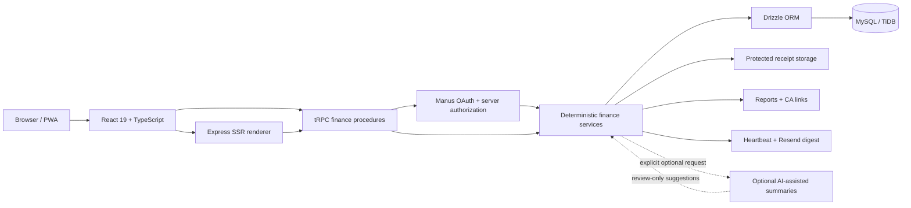

<div align="center">

# Arthra

**Personal finance, built for India.**

A full-stack personal-finance workspace designed around everyday Indian financial workflows — income and expense tracking, category budgets, shared Expense Spaces, financial-year reports, and controlled read-only sharing.

[](./LICENSE)
[](https://github.com/Abhirai2006/arthra/stargazers)
[](https://github.com/Abhirai2006/arthra/network/members)
[](https://github.com/Abhirai2006/arthra/commits)
[](#testing)

[](https://react.dev)
[](https://www.typescriptlang.org)
[](https://tailwindcss.com)
[](https://trpc.io)
[](https://orm.drizzle.team)
[](#tech-stack)
[](#testing)

<p>
  <a href="https://arthrafin-7qakibfj.manus.space"></a>
  <a href="https://arthrafin-7qakibfj.manus.space/demo"></a>
  <a href="https://github.com/Abhirai2006/arthra"></a>
  <a href="./USER_GUIDE.md"></a>
</p>

</div>

---

## Table of Contents

- [Screenshots](#screenshots)
- [Why Arthra?](#why-arthra)
- [Key Features](#key-features)
  - [Personal Finance](#personal-finance)
  - [Budgets & Analytics](#budgets--analytics)
  - [Expense Spaces](#expense-spaces)
  - [Reports](#reports)
  - [Product Experience](#product-experience)
- [Smart Financial Insights](#smart-financial-insights)
- [Built for Indian Financial Workflows](#built-for-indian-financial-workflows)
- [Security & Privacy](#security--privacy)
- [Tech Stack](#tech-stack)
- [Architecture](#architecture)
- [Try the Demo](#try-the-demo)
- [Testing](#testing)
- [Run Locally](#run-locally)
- [Contributing](#contributing)
- [License](#license)

---

## Screenshots

<table>
  <tr>
    <td align="center"><strong>Landing page</strong></td>
    <td align="center"><strong>Interactive demo walkthrough</strong></td>
  </tr>
  <tr>
    <td></td>
    <td></td>
  </tr>
  <tr>
    <td align="center"><strong>Mobile landing</strong></td>
    <td align="center"><strong>Mobile demo flow</strong></td>
  </tr>
  <tr>
    <td></td>
    <td></td>
  </tr>
</table>

<p align="right"><a href="#arthra">↑ back to top</a></p>

## Why Arthra?

Arthra focuses on practical personal and household financial record-keeping rather than trying to become a banking or investment platform. Its core design decisions support:

- Indian financial-year conventions (April–March)
- INR-aware currency handling with integer-paise storage
- GST-aware transaction records
- Scoped shared financial spaces (Expense Spaces)
- Reviewable, revocable report sharing
- Privacy-conscious handling of finance data

## Key Features

### Personal Finance

- Income and expense tracking with categories, accounts, notes, search, and filtering
- Receipt attachments with protected retrieval paths
- INR formatting with integer-paise storage for monetary values

### Budgets & Analytics

- Monthly category budgets with animated utilization indicators
- Spending trends, category distribution, unusual-spend cues, recurring-spend detection, and budget-risk signals
- Optional, explicit AI-assisted summaries that remain distinct from deterministic calculations

### Expense Spaces

- Separate financial contexts for personal, household, trip, or group spending
- Owner, Editor, and Viewer roles with server-enforced scoped access
- Invitations plus shared categories and accounts for permitted members

### Reports

- April–March financial-year reporting with GST references
- CA-oriented CSV export and time-limited, revocable read-only report links

### Product Experience

- Responsive mobile interface, dark and light themes, PWA assets, accessible controls, reduced-motion support, and a read-only demo mode

<p align="right"><a href="#arthra">↑ back to top</a></p>

## Smart Financial Insights

Arthra combines deterministic financial calculations with optional AI-assisted summaries to help users interpret their existing transaction data.

| Deterministic insights | Optional AI-assisted summaries |
| --- | --- |
| Spending trends, recurring expenses, budget-risk signals, and unusual-spending patterns. | Concise natural-language summaries of available authorized aggregates through the server-side application flow. |

AI-assisted summaries do not automatically create or modify transactions, and receipt suggestions remain user-reviewable drafts.

> **Note:** Arthra is a financial record-keeping and analysis workspace. Its insights are informational and are not financial, investment, tax, legal, or accounting advice.

## Built for Indian Financial Workflows

Arthra is designed around conventions commonly used in Indian personal and household financial record-keeping. Monetary values are represented as integer paise, and financial-year reporting follows the April–March cycle.

The product uses INR and `en-IN` formatting, supports lakh/crore-friendly presentation, keeps GST-related transaction information close to the record, and includes CGST/SGST or IGST context where relevant. It does not claim government, banking, tax, or GST endorsement.

## Security & Privacy

<details>
<summary><strong>Expand for details</strong></summary>
<br>

- Authentication protects private workspace access
- Finance procedures enforce authorization server-side
- Expense Space permissions are role-based
- Protected routes do not serialize financial records into public SSR HTML
- Receipt files use protected retrieval paths
- CA report links can be time-limited and revoked
- Financial values are stored as integer paise

</details>

Arthra is designed with financial-data privacy in mind, but it should not be presented as a regulated banking or financial institution.

<p align="right"><a href="#arthra">↑ back to top</a></p>

## Tech Stack

| Layer | Technology |
| --- | --- |
| Frontend | React 19, TypeScript |
| Styling | Tailwind CSS and project CSS tokens |
| UI | Radix UI / shadcn components |
| Routing | Wouter |
| Data fetching | TanStack Query |
| Charts | Recharts |
| Animation | Framer Motion |
| Backend | Express |
| API | tRPC |
| Serialization | SuperJSON |
| Database | MySQL / TiDB |
| ORM | Drizzle ORM |
| Authentication | Manus OAuth |
| Storage | Secure object storage |
| Email | Resend |
| Testing | Vitest |
| PWA | Service Worker and Web App Manifest |

## Architecture



Arthra separates the client experience from server-side financial procedures, authorization, persistence, and protected file handling. Core financial calculations remain deterministic; optional AI-assisted summaries operate only through the server-side flow after an explicit request and never create or modify transactions automatically.

For the full architecture at any scale, use the **[interactive architecture map](https://arthrafin-7qakibfj.manus.space/architecture)** — it supports zoom, pan, keyboard controls, and component inspection without modifying the application.

<p align="right"><a href="#arthra">↑ back to top</a></p>

## Try the Demo

Arthra includes a **[read-only demo environment](https://arthrafin-7qakibfj.manus.space/demo)** for recruiters, interviewers, and product evaluation. It:

- Requires no sign-in
- Keeps a visible `DEMO DATA` label at all times
- Uses fictional data only, and never modifies a real user account
- Walks through the dashboard, transactions, budgets, analytics, Expense Spaces, and reports in one guided flow

## Testing

The automated suite currently has **27 passing tests** across financial calculations, Indian financial-year boundaries, authorization, transactions, receipts, budgets, analytics, Expense Spaces, CA reports, share-link revocation, SSR privacy behavior, onboarding, and demo isolation.

```bash
pnpm check
pnpm test
pnpm build
```

## Run Locally

Use Node.js 22 and pnpm. The managed project environment supplies database, OAuth, storage, and optional email settings — do not commit `.env` files or credentials.

```bash
gh repo clone Abhirai2006/arthra
cd arthra
pnpm install --frozen-lockfile
pnpm dev
```

For the complete first-run workflow, operational notes, scheduler details, and troubleshooting guidance, read the [User Guide](./USER_GUIDE.md) and [verification notes](./verification_notes.md).

<p align="right"><a href="#arthra">↑ back to top</a></p>

## Contributing

Contributions, bug reports, and feature requests are welcome. Please open an [issue](https://github.com/Abhirai2006/arthra/issues) or submit a pull request.

## License

Arthra is available under the [MIT License](./LICENSE).

---

<div align="center">

**[Live Demo](https://arthrafin-7qakibfj.manus.space) · [GitHub](https://github.com/Abhirai2006/arthra)**

</div>
