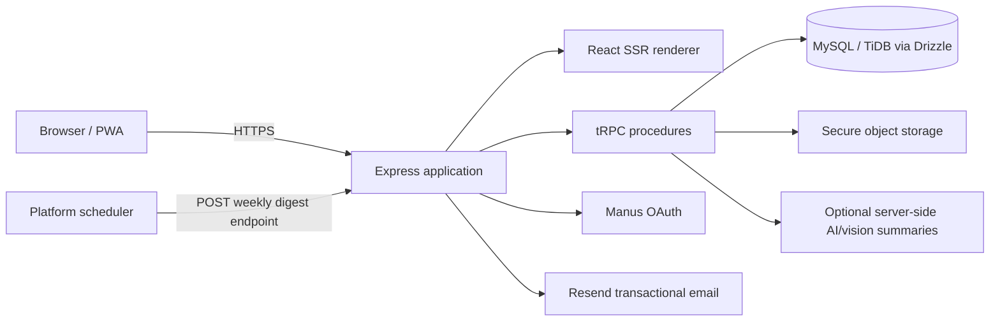

# Arthra

## Personal finance, built for India.

> **Arthra** is a private, India-native personal-finance workspace for recording everyday money, coordinating carefully scoped shared spending, and preparing clear financial-year records for review. It is designed to begin as a welcoming product experience—not a blank dashboard—and to keep personal financial records protected behind authentication.

[Live application](https://arthrafin-7qakibfj.manus.space) · [Try the safe demo](https://arthrafin-7qakibfj.manus.space/demo) · [GitHub source mirror](https://github.com/Abhirai2006/arthra) · [User guide](./USER_GUIDE.md) · [MIT License](./LICENSE)


## Contents

| Section | What it covers |
| --- | --- |
| [Product overview](#product-overview) | The financial workflows Arthra currently supports. |
| [Demo mode](#demo-mode) | A safe two-minute product walkthrough with fictional, non-persistent records. |
| [For new users](#for-new-users) | The first-run tour and a practical everyday workflow. |
| [Architecture](#architecture) | Client, server, data, SSR, storage, and scheduled delivery design. |
| [Run locally](#run-locally) | Prerequisites, install, development, build, and verification commands. |
| [Configuration](#configuration) | Required managed settings and why each one exists. |
| [Security and privacy](#security-and-privacy) | Data boundaries, permissions, and operational safety model. |
| [Testing and operations](#testing-and-operations) | Release gates, weekly digest monitoring, and troubleshooting. |
| [Contributing and GitHub sync](#contributing-and-github-sync) | Safe maintenance workflow and source-mirror procedure. |

## Product overview

Arthra uses a **public, animated marketing surface** to explain the product without reading or exposing financial records. After secure sign-in, each person enters a protected workspace for their own money and only the shared Expense Spaces to which they have been granted access.

| Area | Included capabilities | Practical result |
| --- | --- | --- |
| Personal records | Income and expense transactions, categories, accounts, notes, GST flags, live dates, edits, deletion, search, and filters. | A usable daily ledger rather than a static finance mock-up. |
| INR correctness | Values persist as integer paise and render with `en-IN` formatting. Financial years follow **1 April–31 March**. | Calculations avoid floating-point currency drift and match common Indian reporting periods. |
| Receipts | Optional image and PDF receipt attachment with preview metadata. An explicit image-only smart-assist control can suggest a draft description, amount, date, GST context, and category; the user must review and apply it before saving. | Supporting evidence remains separate from transactional query data and no suggested field writes a transaction automatically. |
| Budgets | Monthly per-category budgets, animated SVG rings, and clear on-track, watch, and over-budget states. | Spending boundaries can be checked without decoding a dense chart. |
| Expense Spaces | Owner, editor, and viewer roles; shared categories and accounts; member visibility; time-limited invitations. | Shared trip, household, or group context can remain deliberately scoped. |
| Analytics | Six-month charts, category distribution, deterministic trend/recurring-spend/budget-risk signals, unusual-spend cues, and an explicit optional AI summary. | Calculated facts and AI-generated prose are clearly separated; neither is financial advice. |
| Reports | Apr–Mar reporting, GST references, CA-oriented CSV export, and time-limited, revocable read-only links. | A reviewer can receive a structured handoff without receiving workspace access. |
| Weekly digest | An idempotent email handler invoked by a deployed scheduler every Monday at 08:00 IST. | A digest is delivered by infrastructure scheduling, not by a fragile browser or process timer. |
| Product quality | Dark and repaired light themes, responsive mobile navigation, PWA assets, reduced-motion support, semantic landmarks, and accessibility labels. | The product is designed for day-to-day mobile use as well as desktop review. |

## Demo mode

The public **[Try Demo](https://arthrafin-7qakibfj.manus.space/demo)** route is a labelled, read-only walkthrough for recruiters, interviewers, and product evaluators. Its `DEMO DATA` badge remains visible and the page uses static fictional values only. It does not call workspace APIs, does not authenticate a visitor, does not store demo interactions, and cannot blend demo content into a real financial account.

| Demo surface | What it illustrates | Boundary |
| --- | --- | --- |
| Dashboard | Fictional income, expenses, savings, and budget posture. | Static sample values; never a user’s records. |
| Transactions | A realistic-looking ledger with generic merchants and categories. | Read-only; no create, edit, or delete path. |
| Budgets and analytics | Healthy, near-limit, and over-budget states; calculated and AI-summary examples. | Labels explicitly identify illustrative content. |
| Expense Spaces and reports | Personal and Family space concepts, scoped roles, and CA-ready reporting. | No invitation, membership, report, or share link is created. |

Use **Exit demo** at the top or bottom of the walkthrough to return to the public site. A new private workspace always starts separately through sign-in.

## For new users

The first authenticated workspace visit opens **Arthra Quick Start**, a concise four-step guide. It uses **Next**, **Back**, **Skip for now**, and **Finish tour** controls, so a person can learn at their own pace without being blocked from the product. Completion is stored only as a local, non-financial browser preference and is scoped to the signed-in user.

The guide can be reopened at any time: select the account menu at the bottom of the desktop sidebar and choose **Show quick-start guide**. This is intentionally discoverable rather than a one-time dead end.

| Suggested first session | Where to go | What to do |
| --- | --- | --- |
| 1. Capture one real moment | **Transactions** | Add one income or expense, choose its category and account, include GST information when relevant, and attach a receipt only if it is useful. |
| 2. Set a simple boundary | **Budgets** | Create one monthly category budget. Treat the ring as a prompt to investigate context, not as a judgement. |
| 3. Share only when needed | **Expense Spaces** | Create a separate space for a trip or household, then invite people with the smallest role that enables their work. |
| 4. Review the month | **Analytics** and **Reports** | Review trends, then export the relevant financial-year ledger or create a revocable CA link when a structured handoff is needed. |

> **Important:** Arthra is a record-keeping workspace. It does not provide tax, legal, accounting, insurance, lending, or investment advice. Users should review their own records and consult a qualified professional for decisions that require professional judgement.

## Architecture

Arthra is a TypeScript full-stack web application. The React client and Express server share typed contracts through tRPC and SuperJSON. The architecture keeps unauthenticated product copy indexable while preventing authenticated money data from being serialized into public HTML.



| Layer | Technology | Responsibility |
| --- | --- | --- |
| Client | React 19, TypeScript, Wouter, TanStack Query, Framer Motion, Radix/shadcn, Recharts | Responsive workspace, accessible controls, routed screens, animation, and query-state hydration. |
| Server | Express 4, tRPC 11, SuperJSON | Typed API boundary, OAuth-aware request context, SSR composition, scheduled digest endpoint, and authorization enforcement. |
| Data | Drizzle ORM with MySQL/TiDB | Transaction, receipt metadata, budget, Expense Space, membership, invite, reporting, and digest-preference persistence. |
| Files | Preconfigured secure object storage | Receipt bytes and protected retrieval paths; no receipt BLOBs in the relational database. |
| Authentication | Manus OAuth and signed session handling | Authenticated workspace access without exposing credentials to the client. |
| Email | Resend REST API | Transactional weekly-digest delivery after a verified sender is configured. |
| Scheduling | Platform Heartbeat | Deployed Monday callback; no in-process `setInterval` or browser-dependent scheduling. |

### Server-side rendering model

Public routes—including the home page, Privacy Policy, Terms, invitation preview, and public CA report—produce semantic HTML before client JavaScript runs. Per-route metadata, canonical hints, and dehydrated public query state are composed by Express.

Protected finance routes deliberately return a **semantic `noindex` workspace shell** during SSR. The shell includes meaningful route heading and navigation copy while excluding finance data. The client’s first render now matches that shell exactly; after hydration it loads the authenticated layout and queries private data. This fixes the prior React hydration mismatch while preserving the data boundary.

| Route class | Raw HTML behavior | Indexing behavior | Private data in HTML |
| --- | --- | --- | --- |
| Public marketing and legal pages | Full semantic route content | Eligible for indexing | Never included |
| Invitation and CA share pages | Viewer-independent public content when the token is valid | `noindex` | Only the explicitly shared record scope |
| Workspace routes | Semantic title, navigation, and protected-workspace shell | `noindex` | **Never included** |

## Repository structure

```text
client/
  src/
    components/       # Reusable UI, layouts, dialogs, onboarding
    pages/            # Public and authenticated routed screens
    ssr/              # Route classification and safe query prefetching
    entry-client.tsx  # Hydration entry
    entry-server.tsx  # React SSR entry
  public/             # PWA, robots, sitemap, and small static configuration
server/
  _core/              # OAuth, SSR composition, request context, storage proxy
  routers/            # Typed finance procedures and access gates
  financeDb.ts        # Database-backed domain helpers
  digest.ts           # Idempotent weekly digest handler
drizzle/               # Schema and migration assets
shared/                # Currency, financial-year, permissions, CSV, insights, onboarding helpers
scripts/               # Production SSR verifier
docs in root/          # README, verification_notes.md, interaction_audit.md, todo.md
```

## Run locally

### Prerequisites

Use a current **Node.js 22** runtime and pnpm. A database, OAuth configuration, object storage, and optional email configuration are provided by the managed project environment; do not commit `.env` files or production secrets to the repository.

```bash
# Clone the private source mirror (access required)
gh repo clone Abhirai2006/arthra
cd arthra

# Install locked dependencies
pnpm install --frozen-lockfile

# Start the development server
pnpm dev
```

### Quality commands

| Command | Purpose |
| --- | --- |
| `pnpm check` | Type-check the entire TypeScript project without emitting files. |
| `pnpm test` | Run the Vitest unit, authorization, persistence, onboarding, and SSR-regression suite. |
| `pnpm build` | Build the browser bundle, SSR entry, and production Express server bundle. |
| `pnpm format` | Apply the repository’s Prettier formatting rules. |
| `pnpm db:push` | Generate and apply database migrations. Review generated SQL before using it against a production database. |

### Verify production-style SSR locally

Run the production bundle on a known port with its metadata settings, then use the route verifier.

```bash
pnpm build

CANONICAL_ORIGIN=http://127.0.0.1:4101 \
SITE_NAME=Arthra \
PORT=4101 \
NODE_ENV=production \
pnpm start

# In a second terminal
BASE=http://127.0.0.1:4101 bash scripts/verify-ssr.sh
```

The verifier checks public route content and metadata, protected-route `noindex` behavior, canonical hints, and the absence of private data from the protected shell. It should be rerun after changes to routing, providers, SSR prefetching, or route data dependencies.

## Configuration

Secrets and environment values are managed through secure project settings. They must not be committed to source control, logged, or placed in frontend code. The platform supplies several values automatically; the table below records the operational purpose of the relevant settings.

| Setting | Required | Used for | Operational note |
| --- | --- | --- | --- |
| `DATABASE_URL` | Yes | MySQL/TiDB connection | Server-side only. Keep schema and applied migrations aligned. |
| `JWT_SECRET` | Yes | Session integrity | Managed secret; rotate through the deployment environment when needed. |
| `VITE_APP_ID`, `OAUTH_SERVER_URL`, `VITE_OAUTH_PORTAL_URL` | Yes | Manus OAuth flow | Required for secure sign-in and callback handling. |
| `BUILT_IN_FORGE_API_URL`, `BUILT_IN_FORGE_API_KEY` | Yes | Platform services, optional AI summaries, and image receipt suggestions | Server-side key only; no model credential is shipped to the browser. |
| `CANONICAL_ORIGIN` | Yes for production SSR | Canonical URL and social metadata | Set to `https://arthrafin-7qakibfj.manus.space` for the current production domain. |
| `SITE_NAME` | Yes for production SSR | SSR fallback and social site name | Set to `Arthra`. |
| `RESEND_API_KEY` | Required for digest delivery | Resend API authorization | Use a verified sender and a server-side key. |
| `RESEND_FROM_EMAIL` | Required for digest delivery | Digest sender identity | Must match a verified Resend sender/domain. |

### Weekly digest schedule

The production schedule is named **`arthra-weekly-digest`** with task UID `YF9bqtYHWr44u6rWnkYsky`. It sends a POST request to `/api/scheduled/weekly-digest` on the six-field UTC cron expression `0 30 2 * * 1`, which corresponds to **Monday 08:00 IST**.

The route is intentionally cron-only and idempotent. It should remain deployed behind the application server and should not be replaced with local timers, browser notifications, or a development-only process. Check its first real run and future failures in the scheduler execution history and production logs.

## Security and privacy

Arthra treats finance data as sensitive by default. The implementation applies authorization on server procedures, not merely by hiding client interface controls.

| Control | Implementation | Why it matters |
| --- | --- | --- |
| Authentication boundary | Manus OAuth session context gates protected procedures and workspace UI. | A public visitor cannot query a user’s ledger by navigating to a private route. |
| Expense Space roles | Owner, editor, and viewer permissions are evaluated on the server. | Membership prevents cross-space reads and controls changes. |
| Secure receipts | Object-storage bytes are separate from relational metadata and served through protected paths. | Database queries stay efficient and raw receipt bytes are not treated as normal fields. |
| SSR privacy boundary | Protected route HTML is `noindex` and contains no finance query prefetch. | HTML fetchers and search crawlers do not receive a user’s ledger. |
| Share-link control | CA links are time-limited and revocable. | A handoff can be stopped without granting permanent workspace access. |
| Currency correctness | Monetary values are represented as integer paise. | INR totals and budget calculations do not depend on binary floating-point arithmetic. |
| Session-safe onboarding | Tour completion is local, user-scoped, and contains no finance content. | Product education does not become shared account data. |
| Optional AI and receipt assist | The user explicitly requests a summary or image suggestion; only authorised server-side scope is processed and all suggestions remain drafts. | The feature is never a background data export and cannot silently create or modify a transaction. |

## Accessibility, responsiveness, and PWA behavior

The interface uses headings, `main`, `nav`, labelled form controls, semantic dialog titles/descriptions, visible focus behavior, keyboard-operable buttons, and reduced-motion safeguards. Decorative motion is gated by the user’s reduced-motion preference; operational feedback such as button press states remains concise and immediate.

On mobile, Arthra uses responsive cards, touch-friendly controls, and a fixed bottom workspace dock for the most frequent sections. The PWA manifest and service-worker navigation fallback provide installability and a resilient app-shell experience. Test install prompts and offline behavior on the target browser/device before presenting them as a guaranteed user outcome.

## Testing and operations

The automated suite currently contains **23 passing tests** across 12 files. It covers core financial helpers, CA CSV formatting, deterministic insights, recurring-spend and budget-risk calculations, role permissions, OAuth logout, Resend configuration, protected router authorization, persistence through transactions/receipts/budgets/CA links/invites, onboarding storage isolation, the protected SSR shell regression, and the isolated-demo SSR regression.

| Release gate | What to confirm |
| --- | --- |
| Type safety | `pnpm check` exits successfully. |
| Automated behavior | `pnpm test` exits successfully. |
| Production bundle | `pnpm build` exits successfully. |
| SSR behavior | `scripts/verify-ssr.sh` passes against a production-style process. |
| Browser behavior | Review console output for hydration errors, then exercise sign-in, a private route, the quick-start guide, transactions, budgets, Expense Spaces, reports, and mobile navigation. |
| Scheduler behavior | Confirm the weekly digest job remains enabled and inspect its first Monday execution. |

### Troubleshooting

| Symptom | Likely check | Resolution direction |
| --- | --- | --- |
| React hydration warning on a workspace page | Server and client must render the same protected shell before effects run. | Keep private data client-fetched and preserve the `ProtectedRouteShell` first render. Do not branch JSX on browser-only state. |
| Public page has incorrect canonical or social metadata | `CANONICAL_ORIGIN` or `SITE_NAME` may be missing. | Set both values in secure production settings and rerun the SSR verifier. |
| Digest does not arrive | Sender verification, Resend key, or scheduled execution may be failing. | Check scheduler history and production logs before retrying; do not expose the digest route publicly. |
| A shared member sees insufficient or excessive data | Role/membership tests and active Space selection should be reviewed. | Fix authorization in the server procedure first, then update the client affordance. |
| A receipt cannot be viewed | Storage metadata or access proxy may be out of sync. | Verify the transaction’s receipt metadata and protected storage configuration; do not move bytes into the database as a shortcut. |
| Receipt suggestions are unavailable | Image receipt extraction depends on the optional server-side model service. | Attach the receipt normally and complete the transaction manually; no finance workflow is blocked. |
| AI summary fails or appears conservative | The summarizer receives only authorised aggregates and is instructed not to invent records. | Read the deterministic cards first, retry later if needed, and never treat the summary as professional advice. |

## Contributing and GitHub sync

The managed deployment remote is `origin`. The private GitHub source mirror is the `github` remote and should reflect every reviewed, deployed checkpoint.

```bash
# Review exactly what will be shared
git status
git diff

# Run release gates before committing
pnpm check && pnpm test && pnpm build

# Commit reviewed application, test, and documentation changes
git add <reviewed-files>
git commit -m "feat: describe the user-visible change"

# Synchronize the source mirror
git push github main
```

Use a clear, narrow pull-request or commit scope. Add or update Vitest coverage with every business-rule or regression fix. When changing a database schema, review the generated migration, apply it through the platform’s controlled workflow, and verify dependent data paths before release. Never add credentials, receipt downloads, customer data, or unreviewed database dumps to Git history.

## Current product boundaries

Arthra is a strong foundation for a private finance workspace, but some future capabilities require explicit product, security, and operational design before implementation. Consent-based bank aggregation, full document OCR beyond image receipt assistance, predictive cash-flow modeling, notifications, and large-scale email delivery should each be introduced as opt-in, independently audited services rather than simulated data or implicit tracking.

## Suggested next improvements

| Priority | Improvement | Why it is valuable | Delivery note |
| --- | --- | --- | --- |
| 1 | Consent-based bank import with a review queue | Reduces manual entry while preserving user control. | Start with one regulated/consent-capable provider and clear connection revocation. |
| 2 | Renewal reminders for recurring expenses | Recurring-spend detection is already available; user-controlled reminders would make it more actionable. | Make every reminder explainable, dismissible, and explicitly opt-in. |
| 3 | Household settlement proposals | Helps shared Space members resolve balances without exposing unrelated accounts. | Calculate inside the Space boundary and require confirmation before any payment handoff. |
| 4 | Receipt inbox with document/OCR review | Builds on the existing image receipt-assist flow with batching and PDF support. | Treat extraction as a draft, never as silently trusted accounting data. |
| 5 | Cash-flow and tax scenario planning | Turns historical records into actionable planning context. | Label assumptions clearly and avoid presenting output as professional advice. |
| 6 | Notification center and annual review | Creates a useful long-term rhythm without spam. | Default to in-app alerts; make email and push explicitly opt-in. |

## License

Arthra is distributed under the [MIT License](./LICENSE).
