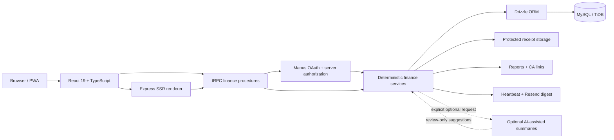

<div align="center">

# Arthra

**Personal finance, built for India.**

A full-stack personal-finance workspace designed around everyday Indian financial workflows — income and expense tracking, category budgets, shared Expense Spaces, financial-year reports, and controlled read-only sharing.

[](./LICENSE)
[](https://github.com/Abhirai2006/arthra/stargazers)
[](https://github.com/Abhirai2006/arthra/network/members)
[](https://github.com/Abhirai2006/arthra/commits)
[](#testing)

[](https://react.dev)
[](https://www.typescriptlang.org)
[](https://tailwindcss.com)
[](https://trpc.io)
[](https://orm.drizzle.team)
[](#tech-stack)
[](#testing)

<p>
  <a href="https://arthrafin-7qakibfj.manus.space"></a>
  <a href="https://arthrafin-7qakibfj.manus.space/demo"></a>
  <a href="https://portfolio-abhirai2006.lovable.app"></a>
  <a href="https://github.com/Abhirai2006/arthra"></a>
  <a href="./USER_GUIDE.md"></a>
</p>

<p align="center">
  <a href="https://arthrafin-7qakibfj.manus.space">
    
  </a>
</p>

</div>

---

## Table of Contents

- [Screenshots](#screenshots)
- [Why Arthra?](#why-arthra)
- [Key Features](#key-features)
  - [Personal Finance](#personal-finance)
  - [Budgets & Analytics](#budgets--analytics)
  - [Expense Spaces](#expense-spaces)
  - [Reports](#reports)
  - [Product Experience](#product-experience)
- [Public Feedback & Website Reliability](#public-feedback--website-reliability)
- [Public Site, Discovery & Consent](#public-site-discovery--consent)
- [Smart Financial Insights](#smart-financial-insights)
- [Built for Indian Financial Workflows](#built-for-indian-financial-workflows)
- [Security & Privacy](#security--privacy)
- [Security Hardening Record](#security-hardening-record)
- [Tech Stack](#tech-stack)
- [Architecture](#architecture)
- [Try the Demo](#try-the-demo)
- [Testing](#testing)
- [Run Locally](#run-locally)
- [Contributing](#contributing)
- [License](#license)

---

## Screenshots

The current captures show the latest public **light** interface: paper-white surfaces, ink typography, intentional green/blue signals, the current responsive navigation, and the consent-gated feedback flow. Dark mode remains available from the public theme control.

| Desktop landing | Desktop feedback |
| --- | --- |
|  |  |

| Mobile landing | Mobile feedback |
| --- | --- |
|  |  |

<p align="right"><a href="#arthra">↑ back to top</a></p>

## Why Arthra?

Arthra focuses on practical personal and household financial record-keeping rather than trying to become a banking or investment platform. Its core design decisions support:

- Indian financial-year conventions (April–March)
- INR-aware currency handling with integer-paise storage
- GST-aware transaction records
- Scoped shared financial spaces (Expense Spaces)
- Reviewable, revocable report sharing
- Privacy-conscious handling of finance data

## Key Features

### Personal Finance

- Income and expense tracking with categories, accounts, notes, search, and filtering
- Review-first transaction-history import for `.csv`, `.xlsx`, and `.xls` files, with column mapping, duplicate checks, and explicit confirmation
- Receipt attachments with protected retrieval paths
- INR formatting with integer-paise storage for monetary values

### Budgets & Analytics

- Monthly category budgets with animated utilization indicators
- Spending trends, category distribution, unusual-spend cues, recurring-spend detection, and budget-risk signals
- Optional, explicit AI-assisted summaries that remain distinct from deterministic calculations

### Expense Spaces

- Separate financial contexts for personal, household, trip, or group spending
- Owner, Editor, and Viewer roles with server-enforced scoped access
- Invitations plus shared categories and accounts for permitted members

### Reports

- April–March financial-year reporting with GST references
- CA-oriented CSV export and time-limited, revocable read-only report links

### Product Experience

- A persisted light/dark control in the shared dashboard shell: desktop sidebar and mobile header access it on Overview, Transactions, Budgets, Expense Spaces, Analytics, and Reports. Each authenticated route inherits the same semantic graphite/paper, green, and blue materials.
- Responsive mobile interface, PWA assets, accessible controls, reduced-motion support, and a read-only demo mode
- Deliberate public footer navigation, grouped into **Explore Arthra**, **Product principles**, and **Creator & code**, with a compact back-to-top utility and responsive touch-friendly layout

### Public Feedback & Website Reliability

Arthra accepts product feedback through a public form that gives a clear inline explanation when a required rating, feedback message, or optional email format needs attention. The form surfaces readable server failures instead of raw validation payloads, and its anti-spam guard rejects non-human submissions before any feedback row is stored.

Public reviews are not created automatically. A real reviewer must explicitly permit public display, and the site owner must manually approve the submission before it appears on the public feedback page. Public review data intentionally excludes contact details and consent metadata. Public links distinguish [Abhishek Rai’s portfolio](https://portfolio-abhirai2006.lovable.app), which presents projects and case studies, from [the Arthra repository](https://github.com/Abhirai2006/arthra), which contains the open-source application code and version history.

For protected finance pages, workspace bootstrap failures and missing active-space states resolve to retryable error screens rather than an indefinite dashboard skeleton. The selected Expense Space stays stable through normal data refreshes, and routine focus changes do not trigger unnecessary workspace bootstrap refetches.

### Public Site, Discovery & Consent

The public site includes internal navigation, a custom 404 response, semantic breadcrumbs on support routes, About, Contact, Waitlist, and Thank You pages, a five-question FAQ section, a favicon, and purposeful CTA content above public form fields. Contact and waitlist submissions are private, consent-based, rate-limited, honeypot-protected, and have no public listing endpoint.

Public analytics are **optional**. The analytics script is not present in the static HTML; visitors can choose “Essential only” or “Allow analytics” from the cookie-preference panel, while private finance data is never sent to website analytics. SSR supplies unique titles, descriptions, canonical URLs, Open Graph image/alt metadata, and appropriate `noindex` directives for conversion and tokenized routes. The sitemap and crawler policy list only intended public discovery routes.

Finance data access is row/scoped at the authenticated application-procedure layer rather than claimed as unsupported database-native RLS. The exact boundary model, endpoint review requirements, and operational distinction are documented in [`docs/DATA_ACCESS_BOUNDARIES.md`](./docs/DATA_ACCESS_BOUNDARIES.md).

<p align="right"><a href="#arthra">↑ back to top</a></p>

## Smart Financial Insights

Arthra combines deterministic financial calculations with optional AI-assisted summaries to help users interpret their existing transaction data.

| Deterministic insights | Optional AI-assisted summaries |
| --- | --- |
| Spending trends, recurring expenses, budget-risk signals, and unusual-spending patterns. | Concise natural-language summaries of available authorized aggregates through the server-side application flow. |

AI-assisted summaries do not automatically create or modify transactions, and receipt suggestions remain user-reviewable drafts.

> **Note:** Arthra is a financial record-keeping and analysis workspace. Its insights are informational and are not financial, investment, tax, legal, or accounting advice.

## Built for Indian Financial Workflows

Arthra is designed around conventions commonly used in Indian personal and household financial record-keeping. Monetary values are represented as integer paise, and financial-year reporting follows the April–March cycle.

The product uses INR and `en-IN` formatting, supports lakh/crore-friendly presentation, keeps GST-related transaction information close to the record, and includes CGST/SGST or IGST context where relevant. It does not claim government, banking, tax, or GST endorsement.

## Security & Privacy

<details>
<summary><strong>Expand for details</strong></summary>
<br>

| Protection area | Implemented safeguard |
| --- | --- |
| Authentication | OAuth state/nonce validation and HTTP-only session cookies protect sign-in and private workspace access. |
| Authorization | Protected tRPC procedures, server-side ownership checks, and Expense Space roles enforce data scopes. |
| Browser boundary | A nonce-based Content Security Policy, anti-framing policy, referrer policy, browser-permission restrictions, and anti-sniffing headers are sent on every response. |
| API resilience | API responses are marked `no-store`; bounded request parsing and a per-client request budget reduce oversized-payload and request-flood exposure. |
| Files and sharing | Receipt MIME/size checks, public-storage key validation, HTTPS-only signed redirects, protected retrieval, and time-limited revocable CA links constrain file and reporting paths. |
| Public feedback | Honeypot, validation, rate limits, explicit consent, and manual approval protect the public-review workflow. |
| Supply chain | Axios and AWS storage SDK packages were updated; the latest audited production dependency scan has **0 critical** advisories. |

</details>

## Security Hardening Record

Arthra is designed with financial-data privacy in mind, but no public application can honestly promise that it is impossible to attack. The hardening record explains verified safeguards, dependency-audit results, testing evidence, and remaining operational responsibilities: [`docs/SECURITY_HARDENING.md`](./docs/SECURITY_HARDENING.md).

The current dependency audit reports **0 critical**, **8 high**, **30 moderate**, and **7 low** production advisories after direct Axios and AWS SDK updates. The remaining high-risk items require an ongoing maintenance decision rather than a misleading claim of absolute safety; notably, the `xlsx` package used for user-selected spreadsheet imports has a published no-fix npm advisory. Treat externally supplied spreadsheets as untrusted and plan a supported parser migration before broadening that importer’s exposure.

<p align="right"><a href="#arthra">↑ back to top</a></p>

## Tech Stack

| Layer | Technology |
| --- | --- |
| Frontend | React 19, TypeScript |
| Styling | Tailwind CSS and project CSS tokens |
| UI | Radix UI / shadcn components |
| Routing | Wouter |
| Data fetching | TanStack Query |
| Charts | Recharts |
| Animation | Framer Motion |
| Backend | Express |
| API | tRPC |
| Serialization | SuperJSON |
| Database | MySQL / TiDB |
| ORM | Drizzle ORM |
| Authentication | Manus OAuth |
| Storage | Secure object storage |
| Email | Resend |
| Testing | Vitest |
| PWA | Service Worker and Web App Manifest |

## Architecture



Arthra separates the client experience from server-side financial procedures, authorization, persistence, and protected file handling. Core financial calculations remain deterministic; optional AI-assisted summaries operate only through the server-side flow after an explicit request and never create or modify transactions automatically.

For the full architecture at any scale, use the **[interactive architecture map](https://arthrafin-7qakibfj.manus.space/architecture)** — it supports zoom, pan, keyboard controls, and component inspection without modifying the application.

<p align="right"><a href="#arthra">↑ back to top</a></p>

## Try the Demo

Arthra includes a **[read-only demo environment](https://arthrafin-7qakibfj.manus.space/demo)** for recruiters, interviewers, and product evaluation. It:

- Requires no sign-in
- Keeps a visible `DEMO DATA` label at all times
- Uses fictional data only, and never modifies a real user account
- Walks through the dashboard, transactions, budgets, analytics, Expense Spaces, and reports in one guided flow

## Testing

The automated suite currently has **37 passing tests** across financial calculations, Indian financial-year boundaries, authorization, transactions, receipts, budgets, analytics, Expense Spaces, CA reports, share-link revocation, SSR privacy behavior, onboarding, demo isolation, transaction import, consent-gated feedback, and dashboard resilience.

```bash
pnpm check
pnpm test
pnpm build
```

## Run Locally

Use Node.js 22 and pnpm. The managed project environment supplies database, OAuth, storage, and optional email settings — do not commit `.env` files or credentials.

```bash
gh repo clone Abhirai2006/arthra
cd arthra
pnpm install --frozen-lockfile
pnpm dev
```

For the complete first-run workflow, operational notes, scheduler details, and troubleshooting guidance, read the [User Guide](./USER_GUIDE.md) and [verification notes](./verification_notes.md).

> **Latest repair verification:** `pnpm check`, `pnpm test`, and `pnpm build` passed locally. The published landing page, grouped footer, feedback page, and unauthenticated dashboard boundary were then checked on the live domain. Authenticated dashboard content was separately verified in the active workspace session.

<p align="right"><a href="#arthra">↑ back to top</a></p>

## Contributing

Contributions, bug reports, and feature requests are welcome. Please open an [issue](https://github.com/Abhirai2006/arthra/issues) or submit a pull request.

## License

Arthra is available under the [MIT License](./LICENSE).

---

<div align="center">

**[Live Demo](https://arthrafin-7qakibfj.manus.space) · [GitHub](https://github.com/Abhirai2006/arthra)**

</div>
